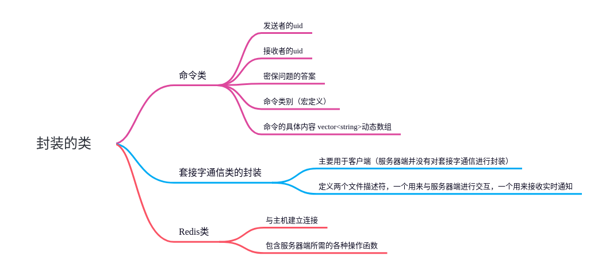
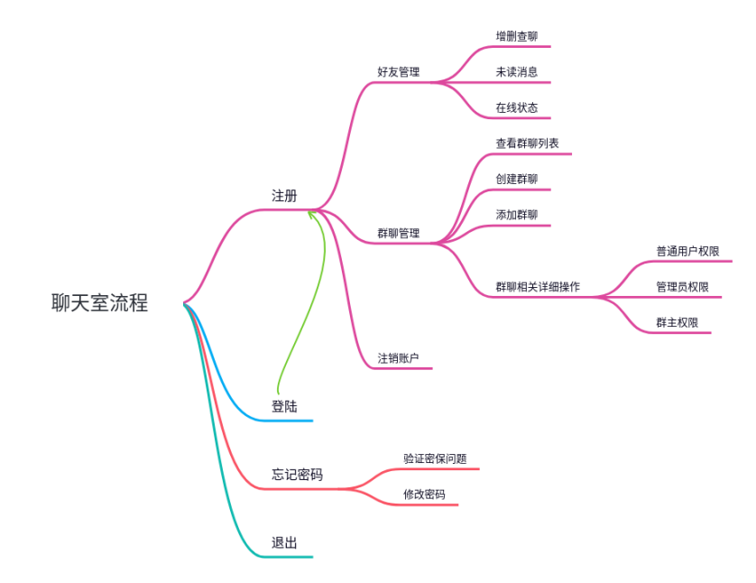
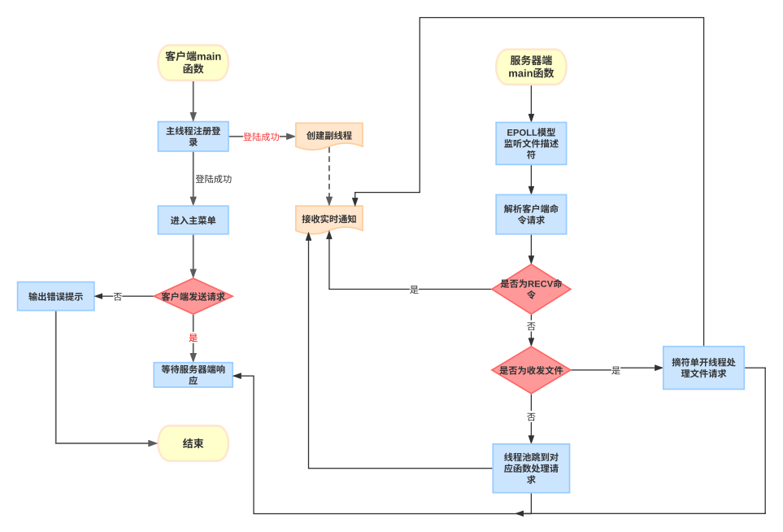
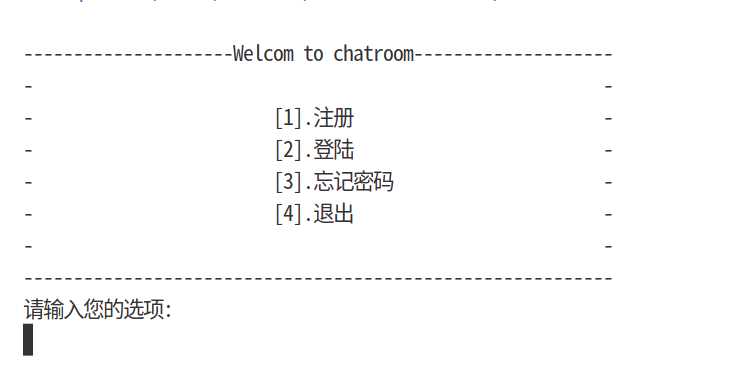
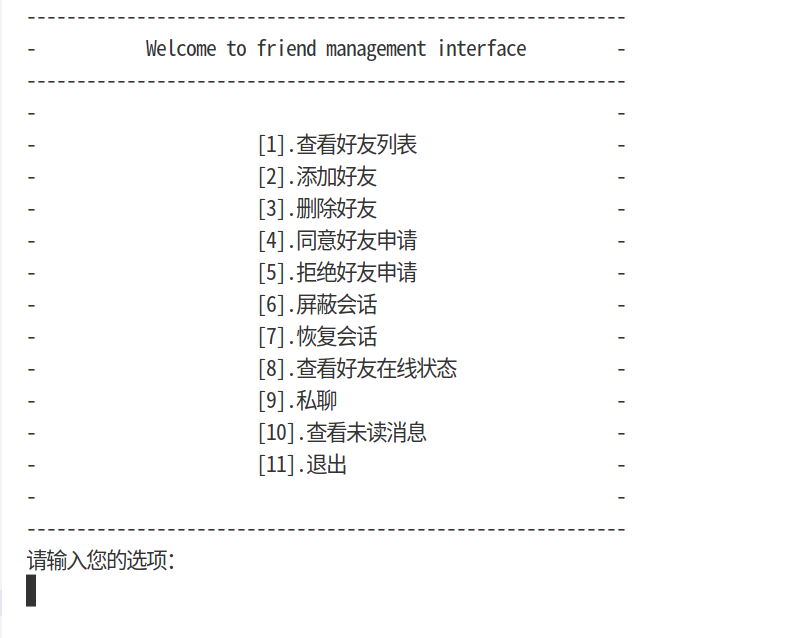

# chatroom
codes for chatroom
本聊天室采用C/S模型，实现了帐号管理、好友管理、群聊管理和文件传输等近30项功能，实现了错误处理函数、套接字通信以及线程池等大类的封装。

## 部分功能流程图展示
以下是部分封装的类

聊天室整体流程展示

## 主要功能介绍
### 实时通知
实时通知主要是在客户端登陆成功后，单开一个线程阻塞等待服务器端的实时接收响应。
服务器端完成一个功能后，比如，通过好友申请后，服务器端新建一个Tcp通信类通知客户端的接收套接字。

### 收发文件
当服务器端一旦监听到客户端的连接请求，会解析命令类取出其中命令类别，然后进行相应的判断。
如果是收发文件，会给该请求单开一个非阻塞的线程执行任务直至任务结束，然后分离线程。
如果是实时通知，就给该uid的通知套接字一个提醒。
如果是其他任务，丢到线程池中执行任务。

## 部分效果展示
注册登录界面

好友管理界面

群聊管理界面

